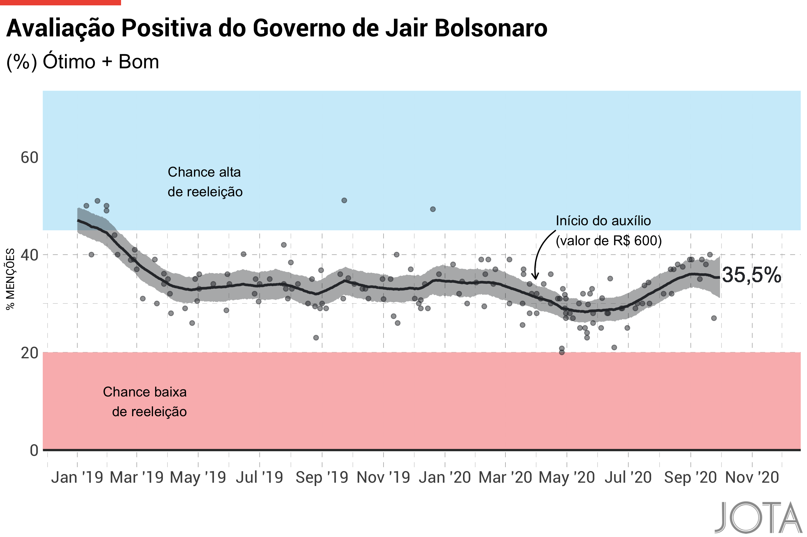
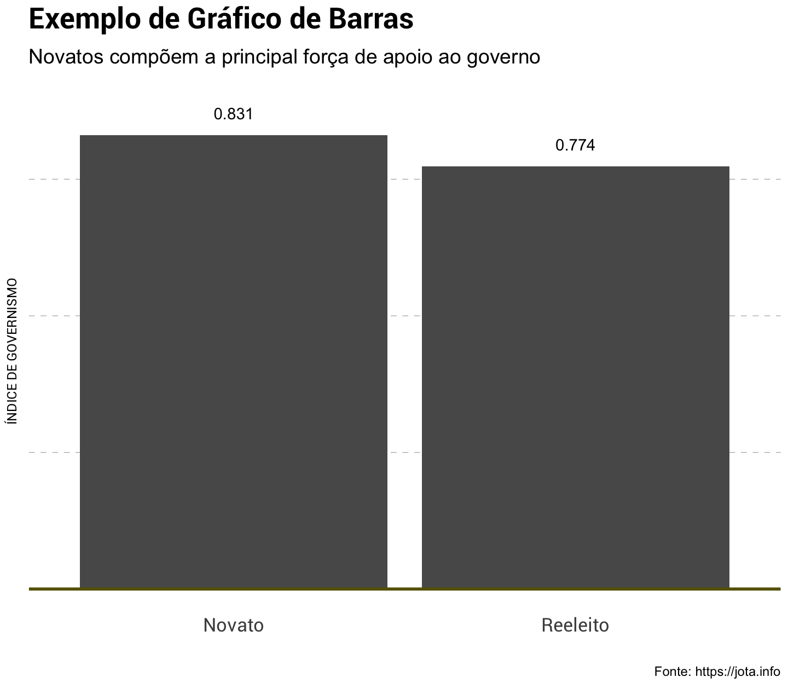
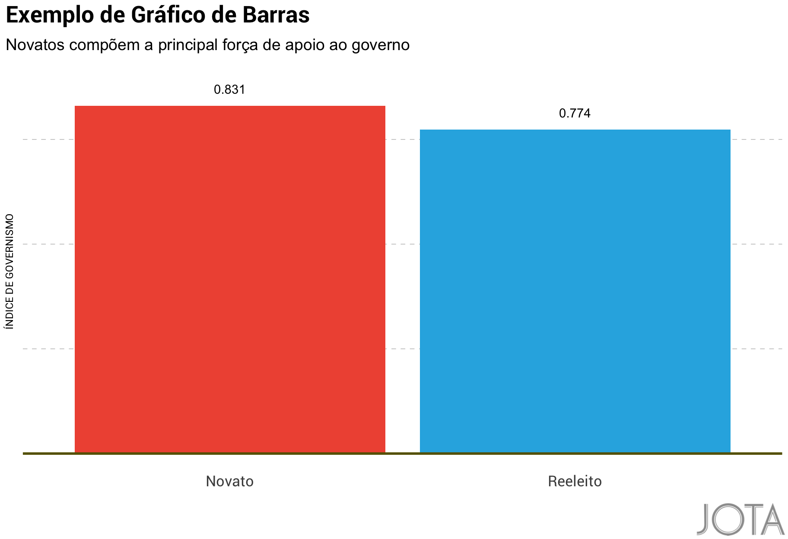
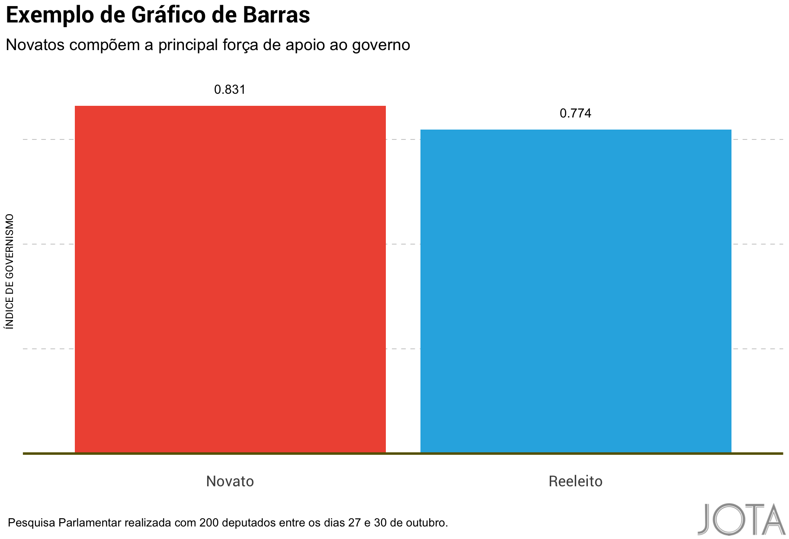

## `jotaR`: Visual aesthetic themes for ‘ggplot2’ used at <https://jota.info>


### Data visualization



### Installation

``` r
library(devtools)
devtools::install_github("JOTAJornalismo/jotaR")
```

### Usage

``` r
library(jotaR)
library(tidyverse)
# current verison
packageVersion("jotaR")
## [1] '0.0.2'

jotaR::import_roboto()
```

``` r
df <- data.frame(id = factor(c("Male", "Female", "Age 21-34", "Age 45-54"), levels = c("Age 45-54", "Age 21-34", "Female", "Male")),
                 mean = c(.4503, .5841, .6543, .4189),
                 se = c(.1558, .1034, .2108, .1850), stringsAsFactors = FALSE)

df %>%
  rowwise() %>%
  mutate(CI95 = list(c(mean + 1.96 * se, mean - 1.96 * se)),
         CI99 = list(c(mean + 2.58 * se, mean - 2.58 * se))) %>%
  unnest(c(CI95, CI99)) %>%
  ggplot() +
  labs(x = NULL, y = NULL) +
  geom_line(aes(x = as.numeric(id), y = CI99, group = id, color = id)) +
  geom_line(aes(x = as.numeric(id), y = CI95, group = id, color = id), size = 3) +
  geom_point(aes(x = as.numeric(id), y = mean, color = id), fill = "white", shape = 23, size = 3) +
  geom_hline(yintercept = 0, linetype = "dashed") +
  scale_x_continuous(labels = c("Age 45-54", "Age 21-34", "Female", "Male"), limits = c(0.7, 4.3), breaks = 1:4) +
  theme_jota(grid="Xx") +
  coord_flip()
```


``` r
df <- data.frame(years=c(1991, 1993, 1997, 2001, 2005, 2007, 2011, 2015),
                 freq=c(43.20, 52.13, 47.93, 46.29, 40.57, 53.88, 48.92, 50.92))


df %>%
ggplot(aes(x=years, y=freq, label=virgula_format(round(freq,1)))) +
        geom_line(size=.7, color="#999999") +
        geom_point(size=3, color="black") +
        geom_text(vjust=c(2, -1, -1.5*sign(diff(diff(df$freq))) + 0.5)) +
        theme_jota(grid = "Yy") +
        geom_hline(yintercept = 0, size = 1, colour="#444444") +
        theme(axis.title.y=element_text(vjust=1.25)) +
        scale_x_continuous("", breaks=seq(1990, 2015, 5), minor_breaks=NULL) +
        scale_y_continuous("", limits=c(0, 60),
                           breaks=seq(0, 60, 10), minor_breaks=NULL)
```


#### Scatterplot

``` r
ggplot(Governismo, aes(x=D1, y=D2)) +
geom_point() +
geom_abline(aes(slope = -Beta1/Beta2, intercept = -Intercept/Beta2)) +
labs(x="IDEOLOGIA (D1)", y="POSICIONAMENTO ECONÔMICO (D2)",
title="Exemplo de Scatterplot",
subtitle="Apoio ao texto da Reforma: Threshold 80% a 20%",
caption="Fonte: https://jota.info") +
theme_jota()
```


#### With background colors

``` r
ggplot(Governismo, aes(x=D1, y=D2)) +
geom_point() +
geom_abline(aes(slope = -Beta1/Beta2, intercept = -Intercept/Beta2)) +
labs(x="IDEOLOGIA (D1)", y="POSICIONAMENTO ECONÔMICO (D2)",
title="Exemplo de Scatterplot",
subtitle="Apoio ao texto da Reforma: Threshold 80% a 20%",
caption="Fonte: https://jota.info") +
theme_jota(panel_col = "#F0F0F0")
```


#### Scatterplot (map of ideal points)

``` r
# Cut points 
mutate(Governismo, 
       Indice = ifelse(Prob_Votacao > 0.8, "Favorável",
                ifelse(Prob_Votacao < 0.2, "Desfavorável", "Neutro"))) %>%
ggplot() +
  geom_point(aes(x = D1, y = D2, color = Indice)) +
  geom_abline(aes(slope = -Beta1/Beta2, intercept = -Intercept/Beta2)) +
labs(x="IDEOLOGIA (D1)", y="POSICIONAMENTO ECONÔMICO (D2)",
     title="Exemplo de Scatterplot",
     subtitle="Apoio ao texto da Reforma: Threshold 80% a 20%",
     caption="Fonte: https://jota.info") +
   theme_jota() + 
  scale_color_idealpoints() +
   theme(legend.position = "top")
```


``` r
# Cut points 
mutate(Governismo, 
       Indice = ifelse(Prob_Votacao > 0.8, "Favorável",
                ifelse(Prob_Votacao < 0.2, "Desfavorável", "Neutro"))) %>%
ggplot() +
  geom_point(aes(x = D1, y = D2, color = Indice)) +
  geom_hline(yintercept = 0, size = .75, colour="#cbcbcb") +
  geom_vline(xintercept = 0, size = .75, colour="#cbcbcb") +
  geom_abline(aes(slope = -Beta1/Beta2, intercept = -Intercept/Beta2)) +
labs(x="IDEOLOGIA (D1)", y="POSICIONAMENTO ECONÔMICO (D2)",
     title="Exemplo de Scatterplot",
     subtitle="Apoio ao texto da Reforma: Threshold 80% a 20%",
     caption="Fonte: https://jota.info") +
  theme_jota(grid = FALSE) + 
  scale_color_idealpoints() +
   theme(legend.position = "top")
```


#### Bar plot

``` r
group_by(Governismo, Reeleito) %>%
  summarize(Indice = mean(Indice, na.rm=TRUE)) %>%
  mutate(Reeleito = ifelse(Reeleito==1, "Reeleito", "Novato")) %>%
  ggplot(aes(x=Reeleito, y=Indice)) +
  geom_col() +
  geom_hline(yintercept = 0, size = 1, colour="#666000") +
  geom_text(aes(label=round(Indice,3)), nudge_y=.04) +
  labs(x="", y="ÍNDICE DE GOVERNISMO",
       title="Exemplo de Gráfico de Barras",
       subtitle="Novatos compõem a principal força de apoio ao governo",
       caption="Fonte: https://jota.info") +
  theme_jota(grid="Y") +
  theme(axis.text.y=element_blank(), legend.position = "none")
```



``` r
group_by(Governismo, Reeleito) %>%
  summarize(Indice = mean(Indice, na.rm=TRUE)) %>%
  mutate(Reeleito = ifelse(Reeleito==1, "Reeleito", "Novato")) %>%
  ggplot(aes(x=Reeleito, y=Indice, fill=Reeleito)) +
  geom_col() +
  geom_hline(yintercept = 0, size = 1, colour="#666000") +
  geom_text(aes(label=round(Indice,3)), nudge_y=.04) +
  labs(x="", y="ÍNDICE DE GOVERNISMO",
       title="Exemplo de Gráfico de Barras",
       subtitle="Novatos compõem a principal força de apoio ao governo",
       caption="Fonte: https://jota.info") +
  theme_jota(grid="Y") +
  theme(axis.text.y=element_blank(), legend.position = "none") +
   scale_fill_jota()
```


#### Using with logos

``` r
finalize_ggplot(plot = pl,
 width_pixels = 640,
 height_pixels = 450)
```



``` r

finalize_ggplot(plot = pl,
 source = "Pesquisa Parlamentar realizada com 200 deputados entre os dias 27 e 30 de outubro.",
 width_pixels = 640,
 height_pixels = 450)
```



### jotaR Metrics
