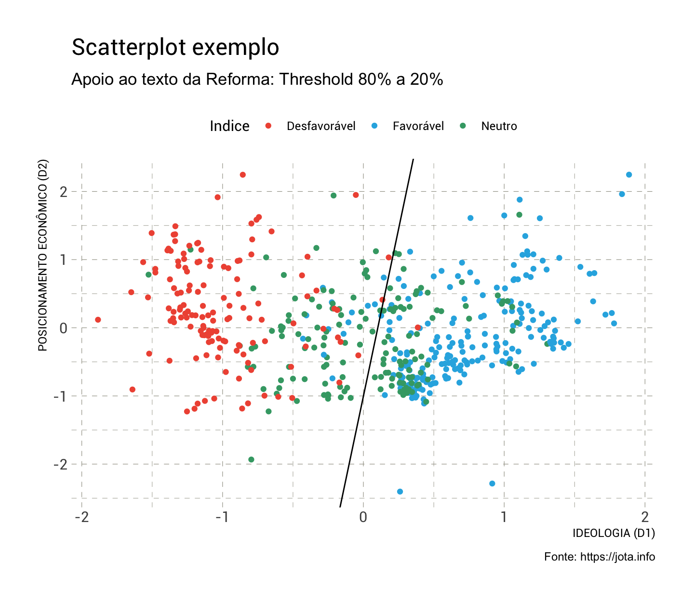
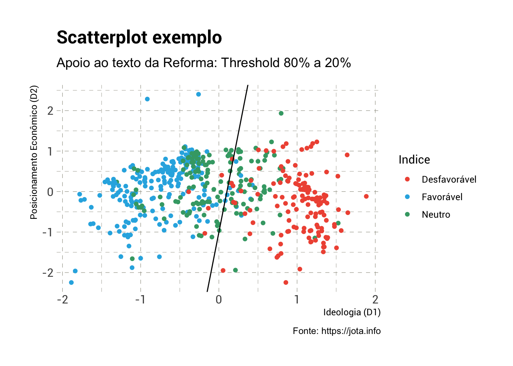
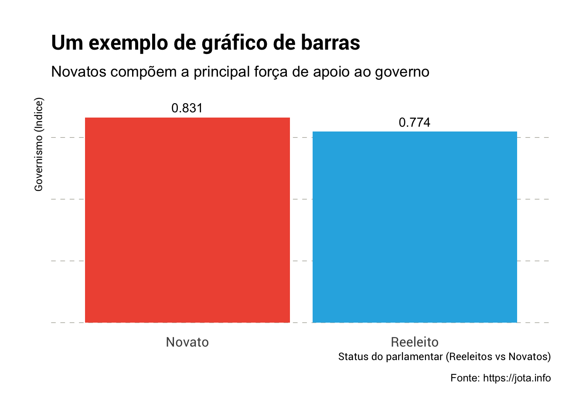

## `rJOTA`: Visual aesthetic themes for ‘ggplot2’ used in <https://jota.info>

### Installation

``` r
library(devtools)
devtools::install_github("JOTAJornalismo/rJOTA")
```

### Usage

``` r
library(rJOTA)
library(tidyverse)
# current verison
packageVersion("rJOTA")
## [1] '0.0.1'
```

#### Scatterplot

``` r
# Inverter a dimensão 
Governismo <- mutate(Governismo, D1 = D1 * (-1),
                                 D2 = D2 * (-1))

ggplot(Governismo, aes(x=D1, y=D2)) +
geom_point() +
labs(x="IDEOLOGIA (D1)", y="POSICIONAMENTO ECONÔMICO (D2)",
title="Um exemplo de scatterplot",
subtitle="Apoio ao texto da Reforma: Threshold 80% a 20%",
caption="Fonte: https://jota.info") +
theme_jota()
```



``` r
# Cut points 
mutate(Governismo, Indice = ifelse(Prob_Votacao > 0.8, "Favorável", ifelse(Prob_Votacao < 0.2, "Desfavorável", "Neutro"))) %>%
ggplot() +
  geom_point(aes(x = D1, y = D2, color = Indice)) +
  geom_abline(aes(slope = -Beta1/Beta2, intercept = -Intercept/Beta2)) +
labs(x="Ideologia (D1)", y="Posicionamento Econômico (D2)",
     title="Scatterplot exemplo",
     subtitle="Apoio ao texto da Reforma: Threshold 80% a 20%",
     caption="Fonte: https://jota.info") +
  theme_jota() + 
  scale_color_jota()
```



#### Bar plot

``` r
group_by(Governismo, Reeleito) %>%
  summarize(Indice = mean(Indice, na.rm=TRUE)) %>%
  mutate(Reeleito = ifelse(Reeleito==1, "Reeleito", "Novato")) %>%
  ggplot(aes(x=Reeleito, y=Indice, fill=Reeleito)) +
  geom_col() +
  geom_text(aes(label=round(Indice,3)), nudge_y=.04) +
  labs(x="Status do parlamentar (Reeleitos vs Novatos)", y="Governismo (Indice)",
       title="Um exemplo de gráfico de barras",
       subtitle="Novatos compõem a principal força de apoio ao governo",
       caption="Fonte: https://jota.info") +
  theme_jota(grid="Y") +
  theme(axis.text.y=element_blank(), legend.position = "none") +
   scale_fill_jota()
```



### rJOTA Metrics

| Lang | \# Files |  (%) | LoC | (%) | Blank lines |  (%) | \# Lines |  (%) |
| :--- | -------: | ---: | --: | --: | ----------: | ---: | -------: | ---: |
| R    |        5 | 0.83 | 157 | 0.8 |          45 | 0.71 |      149 | 0.84 |
| Rmd  |        1 | 0.17 |  40 | 0.2 |          18 | 0.29 |       28 | 0.16 |
